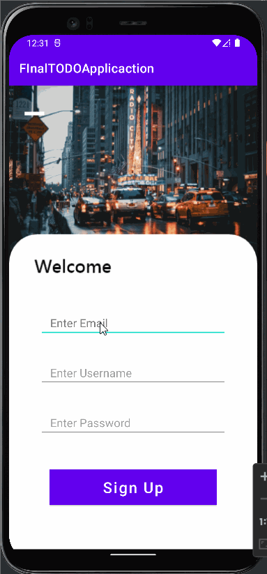
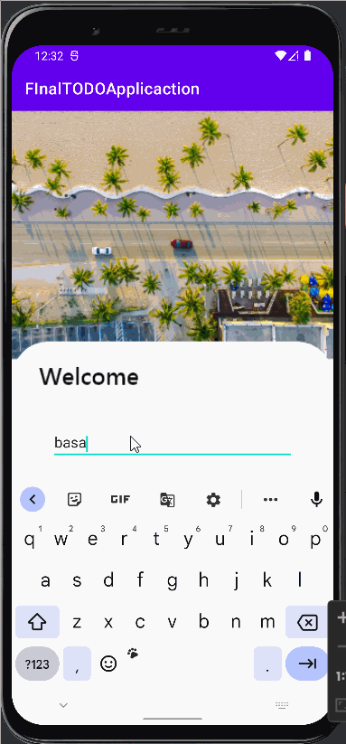
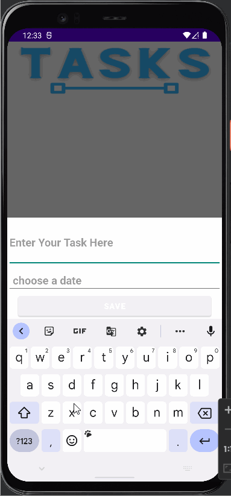
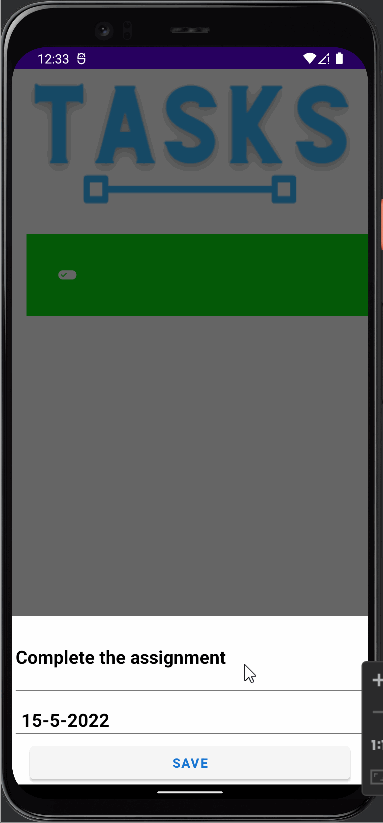

# todo-application-final

First we register through register button

After register we login

To add task we click all(+) button 

To update we swipe right and update the task

To delete we swipe left and delete the task 

