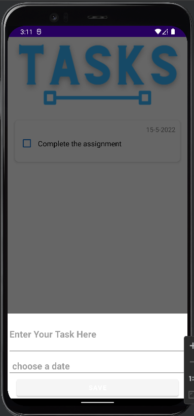
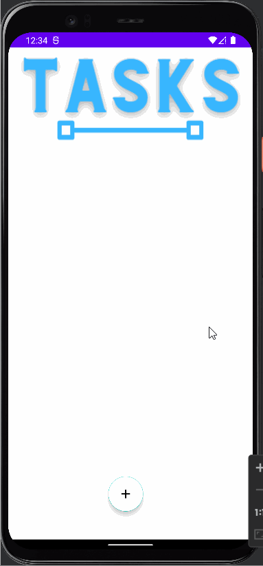

# todo-application-final

###### Home Screen
This is the first screen we see when we run the application

###### Register Screen
In order to use the app we first register 

###### Login Screen
After we register, we login using username and password

###### Task Screen
Task screen where all the task are stacked.

###### Add Task
Here we add the task.

###### Update Task
Here we update the task.

###### Delete Task
Here we delete the task.

## DEMO 

